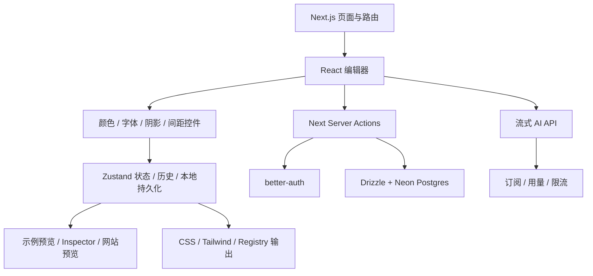
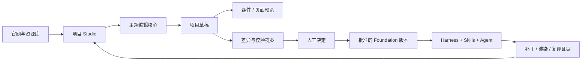

# tweakcn 深度调研与 HappyHands Studio 接入方案

调研日期：2026-09-28。源码基线：`jnsahaj/tweakcn@a3b47b37cba97dd637de517aab52c45ec0f83456`。

后续实施：本调研完成后已接入主题核心与本地编辑流程，最新范围和验证见 [接入记录](tweakcn-integration.md)。下文「当前进度」保留调研当时的状态。

本文区分「源码已存在」「HappyHands 当前已实现」与「建议建设」。这轮是源码调研与架构设计，没有运行 tweakcn 全套服务，也没有完成其编辑器迁移。

## 1. 决策

**推荐复用 tweakcn 的主题编辑核心，接入 React + TypeScript + Vite Studio；保留 creative-os Harness 的独立运行边界。**

tweakcn 解决的是 shadcn 风格应用的主题配置、预览与导出。它非常适合作为 HappyHands 的 Theme Studio 基础，但不能替代品牌系统、组件档案、产品诊断、代码修改和结果验证。

完整产品关系应是：

```text
已有产品 → 提取设计基础 → 人工整理与主题编辑 → 批准设计系统版本
                                                   ↓
            记录判断 ← 对比验证 ← 修改代码 ← 带约束的修改任务
```

无需为了使用这个编辑器，把官网、工作台和 Harness 全部改成 Next.js。也不建议长期把整套 tweakcn 服务通过 iframe 包进官网：这样账户、项目、保存和审批会形成两套独立状态。

## 2. 上游实际架构



### 能力与证据

| 能力 | 源码实际内容 | 对我们的意义 |
|---|---|---|
| 编辑器布局 | 桌面可调整左右面板；移动端 Controls / Preview 标签切换 | 保留专业编辑器布局，避免手机长页面堆叠 |
| 主题模型 | light / dark 两套语义变量；背景、文字、表单、图表、侧栏，以及字体、圆角、阴影、字距、间距 | 已有可用的 shadcn 主题模型，先复用后映射 |
| 编辑历史 | Zustand persist；最多 30 条历史，500ms 合并；undo / redo / checkpoint | 不必重新做最基础的编辑体验，但需验证连续编辑和分支历史 |
| 调整控件 | Colors / Typography / Other / AI；颜色与 HSL 调整、字体选择、阴影、尺寸滑块 | 完整程度明显高于我们当前原型 |
| 示例预览 | Cards、Application、Marketing、Mail、Dashboard、Typography、Custom 懒加载入口 | 用多种实际界面检验主题，不能只看色板 |
| CSS 导入 | 正则提取 `:root` 与 `.dark`，接受已知变量、转换颜色 | 支持常见输入；不能当作任意网站 CSS 提取引擎 |
| 导出 | Tailwind 3 CSS/config、Tailwind 4 `@theme inline`、颜色格式转换、shadcn registry 辅助逻辑 | 按目标工程输出，不能只导出一组 CSS 字符串 |
| 网站预览 | 同源直接应用样式；跨源消息握手、检查、超时和主题更新 | 真实页面预览需要接入协议与部署配合 |
| 云保存 | Server Actions 调用认证、数据库和订阅逻辑 | 需要替换为我们的项目存储接口 |
| AI | 流式生成、模型调用、订阅用量及限流 | 不能只复制一个 AI 标签就算接通 |
| Figma 入口 | 检查到的导出对话框引导使用 shadcncraft 插件及付费设计资源 | 不应宣传为仓库自带完整、独立的 Figma 同步引擎 |

主要证据：[编辑器](https://github.com/jnsahaj/tweakcn/blob/a3b47b37cba97dd637de517aab52c45ec0f83456/components/editor/editor.tsx)、[主题模型](https://github.com/jnsahaj/tweakcn/blob/a3b47b37cba97dd637de517aab52c45ec0f83456/types/theme.ts)、[历史状态](https://github.com/jnsahaj/tweakcn/blob/a3b47b37cba97dd637de517aab52c45ec0f83456/store/editor-store.ts)、[控件](https://github.com/jnsahaj/tweakcn/blob/a3b47b37cba97dd637de517aab52c45ec0f83456/components/editor/theme-control-panel.tsx)、[预览](https://github.com/jnsahaj/tweakcn/blob/a3b47b37cba97dd637de517aab52c45ec0f83456/components/editor/theme-preview-panel.tsx)。

### 依赖边界

该版本使用 Next 15、React 19、Tailwind 4、Zustand、Zod、Culori、Radix 和可调整面板组件。服务端涉及 Neon、Drizzle、better-auth、Polar、AI SDK、限流与统计服务。它是完整应用，所检查的 package 配置不是可直接安装的独立编辑器 SDK。

编辑器入口的 `Theme` 类型来自数据库模型；控件面板直接导入 AI 界面；保存操作直接调用 Next 服务端能力。**移植需要拆依赖，并非复制 components/editor 一个目录即可。**

证据：[package.json](https://github.com/jnsahaj/tweakcn/blob/a3b47b37cba97dd637de517aab52c45ec0f83456/package.json)、[保存操作](https://github.com/jnsahaj/tweakcn/blob/a3b47b37cba97dd637de517aab52c45ec0f83456/actions/themes.ts)、[AI 路由](https://github.com/jnsahaj/tweakcn/blob/a3b47b37cba97dd637de517aab52c45ec0f83456/app/api/generate-theme/route.ts)。

## 3. 可以复用什么，必须补什么

| 层 | 处理方式 | 难度 | 必须改造或验证 |
|---|---|---|---|
| 主题默认值、语义 token | 复用并保留来源 | 低 | 保留双模式；HappyHands 品牌预设单独维护 |
| 颜色转换、阴影计算 | 抽成纯函数 | 低至中 | 边界色值、透明度、非法输入、输出稳定性 |
| CSS/Tailwind 生成 | 复用生成思想与代码 | 中 | 分目标适配；导出不能修改原始草稿；字体输出独立于 Next |
| Zustand 历史与草稿 | 改造复用 | 中 | 项目隔离、schema 迁移、撤销分组、多标签冲突 |
| 控件和预览 | 分阶段迁移 | 中至高 | 移除 Next、AI、支付依赖；预览主题不能污染编辑器外壳 |
| Inspector | 后续迁移 | 中至高 | 能定位语义 token；不把运行时取色误当源码映射 |
| CSS 导入 | 保留常见主题快速导入；增加正式解析适配层 | 中至高 | 嵌套规则、别名、作用域冲突、不支持项不能静默丢失 |
| 跨域网页预览 | 改造协议 | 高 | 来源校验、握手版本、授权页面、超时、CSP/frame 限制 |
| 保存、分享、账户 | 使用 HappyHands 服务接口替换 | 高 | 项目权限、版本冲突、草稿与批准版本分离 |
| AI、支付、社区 | 暂缓搬迁 | 高 | 先验证本地闭环；后续使用自己的运行和计费服务 |
| 品牌、组件、模式档案 | 我们自行建设，连接 Theme Studio | 高 | tweakcn token 不包含完整品牌或组件规范 |

生成器的 Next 字体代码不应成为 Vite 导出的默认模板。我们的苹方字体策略要保存系统字体栈和 fallback；Windows 上没有安装苹方时，不能声称实际渲染使用了苹方，也不随仓库分发未获授权字体。

证据：[生成器](https://github.com/jnsahaj/tweakcn/blob/a3b47b37cba97dd637de517aab52c45ec0f83456/utils/theme-style-generator.ts)、[CSS 解析](https://github.com/jnsahaj/tweakcn/blob/a3b47b37cba97dd637de517aab52c45ec0f83456/utils/parse-css-input.ts)、[Registry 转换](https://github.com/jnsahaj/tweakcn/blob/a3b47b37cba97dd637de517aab52c45ec0f83456/utils/registry/themes.ts)。

## 4. HappyHands 的完整产品结构

### 官网：发现与进入

- Apps：案例和产品优化结果。
- Explore：可选的设计系统与主题预设。
- Screens：有来源、有版本的前后对照。
- UI Elements：组件、变体与交互状态。
- Connect your agent：把项目约束和任务交给开发代理。
- Open Studio：进入自己的项目，不在官网首页塞完整编辑器。

### 项目工作台：六个工作区

| 工作区 | 用户要完成的事 | 主要产物 |
|---|---|---|
| Overview | 看当前产品、问题、最新运行和下一步 | 项目摘要与运行状态 |
| Review | 查看证据、诊断、影响和优先级 | 可追溯的问题清单 |
| Design System | 整理品牌、token、组件、模式 | 候选基础与批准版本 |
| Theme Studio | 编辑主题，在组件和页面上预览 | 主题草稿与变更提案 |
| Changes | 提交限定修改、观察执行和 diff | 补丁、执行记录、PR 链接 |
| Evidence & History | 比较前后结果、接受或拒绝 | 证据包与判断记录 |

Theme Studio 属于 Design System 的编辑能力，也可有独立深链。它不另建一个与项目脱节的主题库。

### Theme Studio 的页面结构

```text
项目 / 设计系统版本 / 未保存状态       撤销 重做 对比 保存草稿 提交审核
┌────────────────┬───────────────────────────────┬─────────────────┐
│ 预设与编辑      │ 预览工具栏                     │ 按需打开的检查栏 │
│                │ 示例 / 项目页面                │ token 来源       │
│ Colors         │ 浅色 / 深色 / 视口             │ 修改前后值       │
│ Typography     │                               │ 对比度结果       │
│ Radius         │ 组件画廊或真实页面              │ 受影响组件       │
│ Spacing        │ 包含 loading/error/disabled    │ 校验与导出       │
│ Shadows        │ 等必要状态                     │                 │
└────────────────┴───────────────────────────────┴─────────────────┘
```

桌面采用主编辑面板 + 大预览，检查栏默认收起。小屏切换「编辑 / 预览 / 变更」，不压缩成三个窄栏。外壳主题与被编辑主题独立；改项目为深色不能让所有工具控件一起失去对比度。

## 5. 目标技术结构

以下是建议的逻辑模块，不表示这些包已经实现。现阶段仍保留 site 与 Harness 两个仓库，通过明确契约连接；暂不做跨仓库大搬迁。

```text
creative-os-site/
  apps/portal/                  官网与资源入口
  apps/studio/                  React 项目工作台与 Theme Studio
  packages/ui/                  HappyHands 工具界面组件
  packages/theme-core/          模型、校验、颜色、阴影、diff、序列化
  packages/theme-editor/        控件、历史、预设、快捷键
  packages/theme-preview/       示例、视口、Inspector、桥接客户端
  packages/theme-adapters/      CSS、Tailwind 3/4、registry 导入导出
  packages/contracts/           项目、草稿、提案、证据的传输契约
  vendor/tweakcn/                来源清单、许可证、上游修订记录

creative-os/
  现有 Harness                  运行编排、Skill、修改执行、证据与复评
  Foundation 适配边界            提案验证、版本批准、约束快照
  Preview bridge               受控项目预览接入
```

依赖规则：theme-core 不依赖 React、数据库或 Harness；编辑器通过接口保存，不直接导入 Next Server Actions；预览只消费主题快照；Harness 只消费经过批准的 Foundation，不读取浏览器未保存状态。



## 6. 数据模型与现有 Harness 接口

推荐新增草稿契约包含：`id`、`projectId`、`schemaVersion`、`revision`、`baseFoundationVersion`、`status: draft`、`styles.light/dark`、`provenance`、`updatedAt`。来源应记录上游预设修订、导入文件、提取证据和人工编辑；不能只记录最终色值。

提交时生成 `ThemeChangeProposal`：草稿修订、基础版本、token 差异、未映射项、校验结果、预览证据引用。保存采用期望修订号进行冲突检查，服务端批准前重新校验；导入用户 JSON 不能直接授予 approved 状态。

对现有主仓库的核验：`packages/experience-core/foundation.js` 要求 `schemaVersion: 0.1`、语义版本、人工/团队 reviewer、reason，以及完整的 `brand/tokens/components/patterns` 快照。token、组件和模式条目必须已决定为 approved 或 deprecated，observed 不能约束生成。

因此适配流程必须是：

1. 读取项目当前 Foundation，保留品牌、组件和模式。
2. 把主题语义 token 映射成 Foundation token 候选，保存来源。
3. 明确 light/dark 表达方式和别名策略。现有校验没有完整的模式语义约定，必须补契约与消费者测试，不能仅增加一个字段就认为端到端支持。
4. 展示 token diff、未知映射和影响；用户批准后生成完整快照。
5. 调用现有批准校验，再发布新版本；失败不覆盖当前版本。
6. 修改任务固定引用该版本；复评固定引用修改前后证据和 evaluator 版本。

Token 草稿不是完整设计系统，导出 CSS 也不等于批准 Foundation。不能用空品牌/组件字段覆盖已有档案来完成“接入”。

## 7. Skills 在哪里发挥作用

| 阶段 | Skill 的工作 | 系统负责的工作 |
|---|---|---|
| 提取 | 从源码和截图整理 token、品牌与组件候选，附证据与不确定性 | 固定输入、存储候选、校验结构 |
| 诊断 | 判断一致性、层级和体验问题，解释优先级 | 保存问题、关联页面和证据 |
| 设计建议 | 提出有理由的主题修改方案 | 展示 diff、预览、历史和人工决定 |
| 修改 | 根据批准约束执行限定任务 | 隔离工作区、记录补丁、限制范围 |
| 复评 | 检查前后效果，解释通过或失败 | 同条件渲染、记录 evaluator 版本与回归结果 |

实时拖动滑块、历史记录、颜色序列化、版本批准和权限检查应由确定性代码完成。Skill 产出建议，不自行把建议标记为人工批准。AI 生成主题日后也走同一套草稿和提案流程。

## 8. 预览与质量边界

上游 iframe hook 存在同源注入与跨源握手两种方式；发送端使用通配 targetOrigin，嵌入脚本检查父窗口及允许来源。接入时应统一为明确的来源配置、协议版本与会话标识，验证消息来源、结构和长度；这属于迁移设计要求，不代表本次已做漏洞审计。

任意网站 URL 不保证可预览：跨域访问限制、嵌入策略、站点是否装桥接脚本都影响结果。MVP 先支持本地受控页面，并明确区分「示例预览」「已连接项目」「截图对照」。

对比度检测只是一个检查项，不能被命名为完整 Experience Score。主题正确也无法证明任务流程、信息架构和页面适配正确。真实修改仍需同视口、同状态截图和交互复评。

证据：[iframe hook](https://github.com/jnsahaj/tweakcn/blob/a3b47b37cba97dd637de517aab52c45ec0f83456/hooks/use-iframe-theme-injector.ts)、[嵌入脚本](https://github.com/jnsahaj/tweakcn/blob/a3b47b37cba97dd637de517aab52c45ec0f83456/public/live-preview.js)。

## 9. 实施顺序与验收

| 阶段 | 交付物 | 完成标准 |
|---|---|---|
| P0 核心剥离 | 来源清单、theme-core、存储接口、明确的 Foundation 模式契约 | 不引入 Next/auth/payment；纯函数可独立测试；样例可往返序列化 |
| P1 完整本地编辑 | 颜色、字体、阴影、圆角、间距、预设、撤销重做、多个预览 | 双模式保持；刷新恢复；预览不污染外壳；移动端可操作 |
| P2 工程导入导出 | CSS 导入、Tailwind 3/4、JSON；明确不支持项 | 导出能在两个最小目标工程构建；非法输入有错误；导出不修改草稿 |
| P3 Foundation 闭环 | diff、提案、人工决定、版本生成、Harness 约束引用 | 品牌/组件不丢失；旧版本冲突阻止提交；拒绝不影响有效版本 |
| P4 真实页面验证 | 受控预览桥、前后截图、修改运行与复评 | 一个真实项目跑通“编辑→批准→修改→渲染→判断”；跨项目数据隔离 |
| P5 后续服务 | 团队保存、分享、AI 建议、社区、计费 | 权限、用量、失败恢复分别有验收；不阻塞前四阶段 |

工作量判断：P0–P2 是多模块迁移，P3–P4 是跨仓库集成，不能按“加一个编辑面板”的量估算。应先以 P0 的真实依赖剥离结果再承诺工期；完整复制上游 SaaS 会额外引入账户、支付和运维成本，当前没有必要。

必须覆盖的测试：连续编辑后的 undo/redo；项目切换和草稿迁移；双模式 round-trip；阴影与透明度；未知 CSS 输入；导出纯函数性；真实 Tailwind 编译；预览样式隔离；桥接来源拒绝和超时；Foundation 快照保留、版本冲突与批准失败回滚。

## 10. 当前进度与差距

当前 site 已有本地 Studio 第一片实现：React/TS 入口、少量 token 控件、双模式、预设、本地草稿、简单组件预览、CSS/JSON 导出；tweakcn 默认主题来源已标注。此前类型检查、构建与有限浏览器检查通过。

**尚未完成：上游完整控件与历史迁移、多场景预览、Inspector、正式 CSS 导入、完整 Tailwind 适配、Foundation 审批接入、项目桥接、云保存和 AI。** 当前原型也没有覆盖上述完整测试集。不能把默认值复用描述成完整 tweakcn 集成。

## 11. 来源维护与调研限制

上游 [LICENSE](https://github.com/jnsahaj/tweakcn/blob/a3b47b37cba97dd637de517aab52c45ec0f83456/LICENSE) 为 Apache-2.0。移植应保留许可证、来源与修改说明；建立文件级来源清单及固定 SHA，更新时逐项比较。品牌标识、字体、示例图片、外部付费设计资源不能仅因代码开源就默认都可随产品分发。

本次读取了 package、编辑器、主题模型、状态、控件、预览、导入导出、保存、数据库、AI 路由及桥接等源码。未启动上游完整后端，未验证第三方服务凭据和线上付费流程。按常规 test/spec 文件名扫描未发现测试文件，package 未见测试脚本；这不是对全部质量保障措施的断言。所有上游链接固定到本次检查修订，后续版本应重新比较。

**下一项：执行 P0，将真正的主题核心从上游依赖中剥离，同时确定 Foundation 双模式 token 契约，再扩建完整编辑器。**
